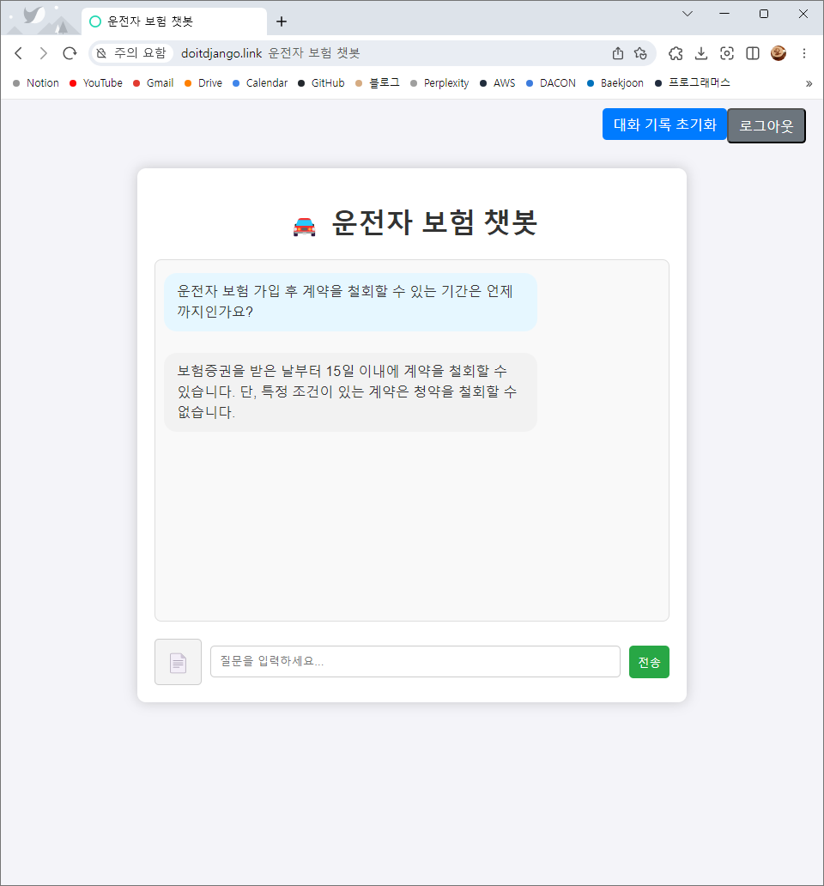
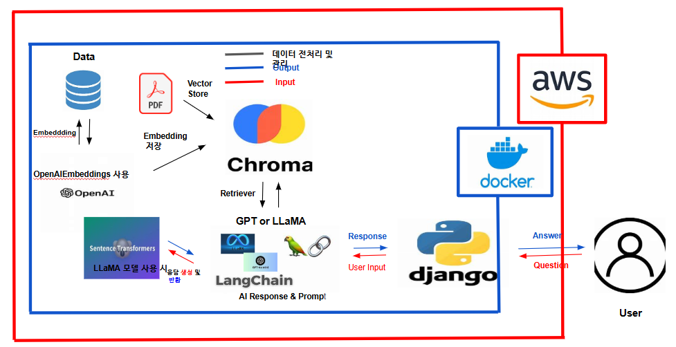

# 🏆 **팀명: 상호들** 🏆

|  |  |  |  |
|:-------------------------------------:|:-------------------------------------:|:-------------------------------------:|:-------------------------------------:|
|  **황호준**                         |  **허상호**                         |  **박초연**                         |  **장정호**                         |
 

# 🚗 운전자 보험 약관 질의응답 챗봇
## 📌 요구사항
- 보험 상품 정보 제공:
약관, 주요 내용 보장 등 정보를 쉽고 명확하게 전달
- 사용자 맞춤형 추천:
사용자 질문에 따라 관련 보험 상품 매칭 
- 보험 가입/유지 안내:
보험 가입 시 유의사항, 계약 변경 등의 절차 안내
- 보험금 청구 절차:
보험금 지급 요건, 필요 서류, 제출 절차 등 지원
- FAQ 자동화:
자주 묻는 질문을 자동 응답해 고객센터 부담 감소
- 위험/보험료 계산:
사용자의 대략적인 보험료 또는 보장 가능성을 안내함

## 📌 화면설계
복잡한 보험 약관의 정보를 일반 사용자나 상담원이 쉽게 조회할 수 있도록 돕는 것이 목표입니다. 
기존 LLM 모델이 제공하는 일반적인 답변을 보완하기 위해 RAG 기술을 도입하여 실질적이고 구체적인 답변을 생성합니다.

## 📌 개발된 LLM연동 웹 애플리케이션

## 📌 시스템 구성도

## 📌 테스트 계획 및 결과 보고서
